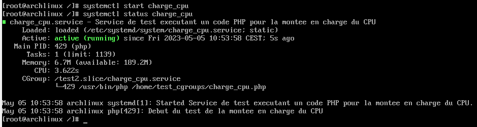
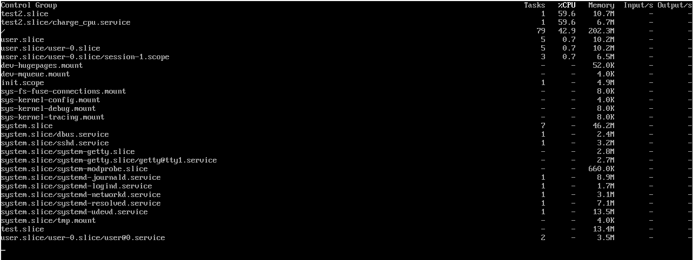
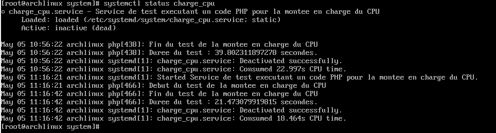

On commence par installer libcgroup.

Instructions à cette adresse : https://aur.chaotic.cx/

Cela nous permet d'utiliser la library libcgroup qui permet une meilleure visualisation des cgroups. (lssubsys -am)

Sur notre arch linux, nous souhaitons utiliser d'abord systemd pour manipuler les cgroups, puis la library libcgroup.

# systemd

Premièrement, si nous souhaitons utiliser systemd pour gérer les cgroups, il faudra effectuer nos opérations dans un répertoire ayant comme chemin /etc/systemd/

Si nous nous mettons ensuite dans le dossier /system/ de systemd, alors nos services seront lancés au démarrage du système si activés.
Si nous nous mettons dans le dossier /user/ de systemd, alors nos services seront lancés à la connexion d'un utilisateur.

On s'intéressera déjà aux slices et aux services.

Les slices vont mettre une limitations aux services/scopes exécutés à travers eux.
Il est possible qu'un service ait plus de limitations que précisées dans le .slice : ce sont des limitations qui sont rajoutées au service.

cd /etc/systemd/system

nano test.slice (ou équivalent, l'important est de créer le fichier test.slice puis de l'éditer)

On rajoute dans le fichier 'test.slice' :

[Slice]
CPUQuota=30%

Cela veut dire que tous ce qui sera executé dans test.slice aura un quota maximal de CPU de 30%.
Il ne sera pas possible de le dépasser dans ce slice.

Il est possible de lancer des scripts dans un slice particulier. Dans ce cas là, on utilisera la commande : systemd-run --slice=test.slice _commandes_

Créons d'abord un simple service qui exécutera un code PHP.
Ce code PHP ne sera compris que d'un simple 'echo' afin de vérifier si le système marche.
Il nous faudra donc un code php, que nous appellerons "index.php" et un fichier .service qui sera situé dans le répertoire /etc/systemd/system/
Ce fichier de service permettra de préciser comment le service doit démarrer, après quel autre service, quels sont les limitations qui lui sont imposées,...
Nous allons aussi pouvoir exécuter un service dans un slice donné.
Toutes les limitations du slice seront donc appliquées au service concerné.
Il est possible également de rajouter d'autres limitations uniques au service.
Il est important de remarquer que le code du service, c'est-à-dire le fichier qui n'est pas un .service, n'a pas besoin d'être dans le même répertoire que son fichier .service.
Il n'a d'ailleurs pas besoin d'être dans un sous-dossier de systemd.

On placera donc dans cet exemple notre fichier "index.php" dans le répertoire /home/test_cgroups/
Son code est le suivant :
index.php
---
<?php

$a="Bienvenue sur l'Arch Linux.";
echo"$a\n";
---

Ce code ne sert qu'à produire un affichage indiquant : Bienvenue sur l'Arch Linux.

Le code du fichier "test_php.service" situé dans le répertoire '/etc/systemd/system' est le suivant:
test_php.service
---
[Unit]
Description=Service de test exécutant un code php

[Service]
Type=simple
Slice=test.slice
MemoryHigh=500M
MemoryMax=800M

ExecStart=/usr/bin/php /home/test_cgroups/index.php
Restart=always

[Install]
WantedBy=multi-user.target
---

Pour une briève explication du fichier : 
Description --> La description du service. Sera affichée quand nous demanderons le status du service.
Type --> Le type de service et comment va-t-il être démarré automatiquement. Simple équivaut à un démarrage dès que possible.
Slice --> Dans quel slice ce service sera exécuté.
MemoryHigh --> Quelle est la limite en mémoire du service. Si le service a absolument besoin de dépasser cette limite, alors ce sera possible mais le service sera ralentit et la mémoire sera récupérée le plus rapidement possible.
MemoryMax --> La limite en mémoire du service. C'est une limite qui n'est pas possible de dépasser.
ExecStart --> Champ obligatoire. Indique la commande que le service doit exécutée pour démarrer.
Restart --> Si plantage, comment le service doit-il redémarrer ? Par défaut, le service essaiera de redémarrer plusieurs fois avant d'arrêter le service.
WantedBy=multi-user.target --> Permet au service d'être lancé automatiquement quand le système a terminé de démarrer. Sans cette ligne, même "systemdctl enable test_php" ne permettrait pas l'exécution automatique du service au démarrage du système.

Mettons à jour la liste des services à l'aide de la commande : "systemctl daemon-reload"
On lance ensuite le service avec la commande : "systemctl start test_php"
Pour voir ce qu'a donné le service, il suffit de faire la commande : "systemctl status test_php"

On peut remarquer que notre service possède l'était "failed" et qu'il a essayé de redémarrer plusieurs fois avant de s'arrêter.
En enlevant la ligne "Restart=always" et en meettant à jour la liste des services, notre service s'exécute bien et s'arrête bien.
Cela est dû au fait que nous souhaitions arrêter le service après l'exécution de son code.
Comme le service s'arrête, le système essaie de le redémarrer mais il n'y a plus de code à exécuter.
Si nous souhaitons que le service s'exécute au démarrage du système, alors il faudra utiliser la commande "git enable test_php".

Nous allons maintenant exécuter un code PHP permettant de mettre une charge conséquente sur le CPU.
Nous utiliserons ce code PHP dans un service afin de voir si une limitation à l'accès du CPU est possible.
Nous regarderons d'abord combien de temps le service met à finir son exécution avec une limite de 60% de quota sur le CPU, puis nous essaierons avec une limite de 100%.

Ce code PHP sera placé dans le répertoire /home/test_cgroups/
Son code est le suivant :

charge_cpu.php
---
<?php

#Montée en puissance niveau calcul --> Charge CPU
$debut=microtime(true);
echo"Début du test pour la montée en charge du CPU.\n";

$a=1;
for($i=0;$i<1000000000;$i++) #1 000 000 000
{
    $a+=$i
}

$fin=microtime(true);
$temps_execution = $fin - $debut;
echo"Fin du test pour la montée en charge du CPU.\n";
echo"Durée du test : $temps_execution secondes \n";

?>
---

Le but de ce code PHP est de lancer un timer, exécuter une boucle qui demandera de nombreux calculs et arrêter le timer à la fin de cette boucle avant d'afficher le temps qu'a pris le code à s'exécuter.

Créons maintenant un slice où nous définirons les limites du service.
Même si nous plaçons une limite de mémoire, ce n'est pas la variable que nous voulons tester.
Le code de notre slice est :

test2.slice
---
[Slice]
CPUQuota=60%
MemoryHigh=200M
MemoryMax=300M
---

Le quota maximum du CPU pour les services s'exécutant dans ce slice est de 60%.

Il ne reste plus que le fichier service :

charge_cpu.service
---
[Unit]
Description=Service de test exécutant un code php pour la montée en charge du CPU.

[Service]
Type=simple
Slice=test2.slice

ExecStart=/usr/bin/php /home/test_cgroups/charge_cpu.php
---

Notre service appartiendra bien au slice 'test2.slice' et exécutera bien notre fichier 'charge_cpu.php'.

Nous mettons à jour la liste des services avec la commande : systemctl daemon-reload
Enfin, nous pouvons lancer le service avec : systemctl start charge_cpu

Si nous faisons la commande 'systemctl status charge_cpu', nous pouvons voir que le service est en cours d'exécution.
Pour voir la charge CPU et mémoire des services en cours d'exécutions, nous pouvons utiliser la commande : systemd-cgtop

Status après démarrage de charge_cpu :

Résultat de systemd-cgtop :

Status après arrêt de charge_cpu :

Nous pouvons voir que le test a duré environ 40 secondes.
Modifions dans 'test2.slice' la valeur de CPUQuota et remplaçons 60% par 100%.

Après cette modification et après avoir relancé le service charge_cpu, nous trouvons le résultat suivant :

Status après arrêt de charge_cpu avec 100% de CPU :

La durée est maintenant de 21 secondes : la limitation du CPU a bien été respectée pour le 1er exemple.

# libcgroup

Même si des commandes libcgroup existent pour créer des cgroups, ils ne seront pas gardés en mémoire au démarrage de la machine.
Nous devrons donc utiliser le fichier '/etc/cgconfig.conf'.

Ce fichier sera créé grâce à la commande 'systemctl start cgconfig'.
On préçisera à l'intérieur quels sont les répertoires cgroupes qui doivent être créés, qui peut administrer le cgroup, qui peut exécuter les fichiers à l'intérieur du cgroup, quelles sont les limitations dans ce cgroup,...

Remarque : l'écriture des limitations dans ce fichier n'est pas identique à la documentation en ligne.
Pour être sûr de modifier les bons paramètres, il faut aller directement dans les fichiers situés dans /sys/fs/cgroup/
Par exemple, memory.limit_by_bytes produit une erreur.
Il faudra utiliser memory.high et memory.max pour obtenir la limitation attendue.

Nous voudrons cependant ne pas modifier les paramètres par défaut du répertoire racine /sys/fs/cgroup.
Nous utiliserons donc la commande : "mkdir /sys/fs/cgroup/memory"

Enfin, nous allons pouvoir modifier le fichier cgconfig.conf.

/etc/cgconfig.conf
---
group memory/test_cpumem {
    perm {
        task {
            uid = root;
            gid = root;
        }
        admin {
            uid = root;
            gid = root;
        }
    }
    cpu {}
    memory {
        memory.high = 10K;
        memory.max = 50K;
    }
}
---

Dans le cgroup situé au répertoire /sys/fs/cgroup/memory/test_cpumem , le seul utilisateur autorisé à modifier et exécuter dans ce groupe est l'utilisateur root.
Il n'y a pas de limitations pour le CPU mais il y a des limitations en mémoire.
Les processus n'essaieront pas de dépasser les 10KB de mémoire et ont comme limite absolue une limite équivalente à 50KB.

Nous devrons ensuite relancer la fichier de configuration afin que les changements se répercutent sur le système.
Nous utiliserons pour cela la commande : "systemctl start cgconfig".
Pour que les changements se fassent automatiquement au démarrage de la machine, nous utiliserons ensuite la commande : "systemctl enable cgconfig".

Pour créer le test permettant de mesurer l'impact sur la mémoire, nous utiliserons un script écrit en C.
Nous utiliserons des mallocs afin d'occuper la mémoire le plus possible.

Remarque : il n'est pas possible de créer un fichier directement dans le répertoire des cgroups.
Nous utilserons une autre commande afin d'exécuter notre script dans le cgroup créé.

Script venant du site : https://zarak.fr/linux/exploration-des-cgroups/

/home/test_cgroups/testMemoire.c
---
---

Nous utiliserons ctte commande afin d'exécuter le script dans notre cgroup : "cgexec -g memory:memory/test_cpumem ./testMemoire"

Il est utile de noter que la manipulation manuelle des cgroups, c'est-à-dire par la modifications des fichiers cpu,memory,... d'un cgroups est différent dans un système sous systemd.
En effet, systemd va monter tous les contrôleurs dans le dossier /sys/fs/cgroup/
Si nous souhaitons créer un cgroup utilisant un de ces contrôleurs, alors il faudra soit démonter le contrôleur de ce dossier, soit créer le cgroup dans ce dossier.

Si nous faisons juste la commande : "mount -t cgroup -o cpu _nom_ _chemin/vers/cgroup_", alors il y a de fortes chances qu'une erreur apparaîsse expliquant que le mount point est occupé.