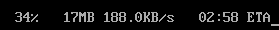

Nous allons maintenant nous intéresser aux manipulations des cgroups sur libvirt et sur LXC.

Nous commencerons par LXC.

# LXC

Nous installerons LXC puis le configurerons selon la page accessible à l'adresse : https://wiki.archlinux.org/title/Linux_Containers

Une particularité est que le bridge par défaut doit être créé par l'intermédiaire de la commande : "systemctl start lxc-net".
Une autre particularité est que nous devons aller dans le fichier '/etc/default/lxc' et mettre le champ "USE_LXC_BRIDGE" à la valeur "true".

Nous installerons une machine "Ubuntu lunar amd64" à l'aide de la commande : "lxc-create -t download -n _nomContainer_"

Notre nom du container sera "root-container".

Si nous souhaitons créer un container non privilégié pour un utilisateur, alors nous utiliserons la commande : 'systemd-run --user --scope -p "Delegate=yes" lxc-create -t download -n _nomContainer_'

Dans cette commande, l'arguemnt "Delegate=yes" permet d'hériter et d'utiliser des contrôleurs déjà monté autre part.
LXC utilise donc aussi les cgroups, ce qui n'est pas très étonnant puisque les cgroups permettent de limiter et d'isoler certaines fonctionnalités.

Une fois que nous lançons le container avec la commande "lxc-start -n _nomContainer_", nous pouvons nous connecter avec lxc-attach.
Nous utiliserons à l'intérieur la commande "mount" et nous pouvons voir que cgroup2 est monté.

Si nous allons sur le répertoire '/sys/fs/cgroup', nous pouvons voir que nous sommes vraisemblablement bien avec un cgroup v2 puis que les contrôleurs ont la syntaxe de cgroups v2.

Pour vérifier que cgroups fonctionne dans le container, nous allons créer plusieurs processus différents qui voudront envoyer des données à l'hôte.
D'abord, nous utiliserons le contrôleur de cgroupv1 "net_prio" afin de vérifier qu'il est possible d'utiliser les contrôleurs de cgroup v1.

Créons donc un répertoire 'net_prio' dans le dossier "/sys/fs/cgroup/".
Si nous essayons la commande "mount -t cgroup -o net_prio net_prio /sys/fs/cgroup/net_prio", nous récupérons l'erreur suivante :


Si nous utilisons la commande lxc "lxc-cgroup", il est possible de modifier la valeur du répertoire "/sys/fs/cgroup" de notre container.
Cependant, ces changements sont temporaires et devront être refait à chaque lancement du container.

Par exemple, nous pouvons modifier la valeur alloué au CPU.
Notre machine ne disposant que d'un seul CPU, nous n'aurons qu'à modifier la valeur de cpu.shares.
Cependant, nous pouvons modifier les CPU alloués au cgroup avec la commande : "lxc-cgroup -n _nomContainer_ cpuset.cpus _numCpu_"
Il faudra noter qu'un interval peut être inscrit afin d'allouer plusieurs CPU.
La commande deviendra : "lxc-cgroup -n _nomContainer_ cpuset.cpus 0-7"

Si nous souhaitons ajouter un contrôleur non disponible normalement dans le container, il faudra alors faire des manipulations supplémentaires.
Dans notre cas avec le contrôleur "net_prio", il doit d'abord être monté sur notre machine hôte avant de pouvoir le monter sur notre container.

Plaçons nous dans le répertoire "/sys/fs/cgroup" et créons un sous-cgroups : "mkdir test_netPrio | mount -t cgroup -o net_prio test /sys/fs/cgroup/test_netPrio".

Une fois cela fait, nous allons dans notre répertoire "/var/lib/lxc/_nomContainer_/".
Nous modifions ensuite le fichier "config" afin de pouvoir écrire dans le dossier "/sys/fs/cgroup" du container.

/var/lib/lxc/_nomContainer_/config
```
...
lxc.mount.auto = "proc:rw sys:rw cgroup:rw:force"
...
```

Cette modification va permettre de lire et écrire dans le répertoire des cgroups sans avoir de problèmes d'autorisations.

Maintenant que tout cela marche pour "net_prio", nous pouvons refaire les manipulations pour "net_cls".

---

Tentative d'utilisation de LXD et d'un container alpine non concluant : 

-> LXD : aucune création faite avec "lxc launch ubuntu" (Bug de ports)
-> Container Alpine : Possibilité de manipuler les cgroups v2 mais impossible de monter un cgroup net_cls.
Il est tout de moins possible de monter un groupe net_prio si il est aussi monté sur l'hôte.

Pour la création d'un container Ubuntu : cgroup est en fonction du cgroup de l'hôte.
Modification de l'hôte nécessaire pour la manipulation des cgroups v1 dans les containers.

Pour ce faire, nous devrons modifier le programme de boot.
Dans notre cas, la machine démarre avec grub.

Il faudra donc modifier le fichier "grub" dans le répertoire "/etc/default".
Ce fichier est le fichier qui est utilisé au démarrage de la machine Linux.
Nous modifierons la ligne suivante afin de pouvoir manipuler les cgroups v1 :

/etc/default/grub
```
...
GRUB_CMDLINE_LINUX="systemd.unified_cgroup_hierarchy=0"
...
```

Cela permet de préçiser que nous voulons une architecture de cgroups hybride, c'est-à-dire que nous pourrons utiliser aussi bien cgroups v1 que cgroups v2.
Il faut cependant noter que cette utilisation est "obsolète" puisque les nouveaux packages manipulant les cgroups se consacrent uniquement à la version 2 et que le développement d'outils pour cgroups v1 n'est plus d'actualité.
Nous n'utiliserons cgroups v1 que pour manipuler cgroups v1 ainsi que le contrôleur "net_cls" qui n'est pas disponible avec cgroups v2.

---

Nous nous placerons cette fois-ci sur une machine Ubuntu.

Créons ce container avec la commande : "lxc-create -t download -n ubuntu_cgroup"
Une fois cela fait, nous lançons le container et nous nous positionnons dedans. ("lxc-attach -n ubuntu_cgroup").

Normalement, si nous allons dans le répertoire "/sys/fs/cgroup", nous pouvons voir une architecture cgroup hybride.
Le contrôleur "net_cls" est donc présent.

Le contrôleur "net_cls" ne sert pas à directement modifier le comportement sur le réseau des tâches, mais permet de les identifier afin que iptable et le pare-feu puissent les identifier.

Nous utiliserons donc la commande "tc" afin de pouvoir modifier le comportement des packets sur le réseau.
C'est ici que nous préciserons le comportement des packets identifiés par les cgroups.

Nous établierons une connexion SSH entre notre container LXC et notre machine hôte.
SSH doit donc être configuré sur notre machine hôte.

Une fois ceci fait, nous pourrons utiliser la commande "scp" afin de transférer des fichiers entre le container LXC et la machine hôte.

Sur notre container LXC, nous utiliserons donc les commandes suivantes afin d'établir des règles pour le réseau :

LXC:
```
sudo tc -s qdisc ls dev eth0
sudo tc qdisc add dev eth0 root handle 3:0 htb default 3
sudo tc class add dev eth0 parent 3:0 classid 3:0 htb rate 700kbps ceil 800kbps prio 0
sudo tc class add dev eth0 parent 3:0 classid 3:1 htb rate 100kbps ceil 200kbps prio 0
sudo tc class add dev eth0 parent 3:0 classid 3:2 htb rate 200kbps ceil 300kbps prio 0
sudo tc class add dev eth0 parent 3:0 classid 3:3 htb rate 300kbps ceil 400kbps prio 0
```

4 classes de réseau sont créées.
Toutes ces classes ont une limite de bande passante différente et la classe utilisée par défaut est la 3ème identifiée par : 3:3

La commande utilisée pour repérer le temps que met un fichier pour être transféré est : "time scp _nomFichier_@_ipAdresseHôte_:_chemin_"

Pour créer un fichier d'une taille de 50M, nous pouvons utiliser la commande : "fallocate -l 50M _nomFichier_"


Mettons ensuite en place un cgroup afin de pouvoir tester de nouvelles modifications sur le réseau.
Pour cela, nous créerons le répertoire 'test' au chemin suivant : '/sys/fs/cgroup/net_cls/'

Nous rajouterons ensuite un filtre afin de préciser le comportement du cgroup avec le réseau.
La commande utilisée sera la suivante : 'sudo tc filter add dev eth0 protocol ip parent 3:0 prio 1 handle 3:3 cgroup'

Nous devrons ensuite indiquer cela à notre cgroup ainsi que pour définir quelle classe est attribuée au cgroup.
Nous voudrons la vitesse la plus basse des classes créées, c'est-à-dire la classe 3:1.

Nous écrivons donc la classe 3:1 dans le classid : "echo 0x00030001 > /sys/fs/cgroup/net_cls/test/net_cls.classid"
Puis nous ajoutons le PID de notre terminal dans les tasks du cgroup : "echo _pidDeNotreTerminal_ > /sys/fs/cgroup/net_cls/test/tasks"



Ensuite, il n'y aura plus qu'à rajouter le PID du processus concerné dans les tasks du cgroup.

# Libvirt

~/container1.xml
```
<domain type='lxc'>
  <name>vm1</name>
  <memory>500000</memory>
  <os>
    <type>exe</type>
    <init>/bin/sh</init>
  </os>
  <vcpu>1</vcpu>
  <clock offset='utc'/>
  <on_poweroff>destroy</on_poweroff>
  <on_reboot>restart</on_reboot>
  <on_crash>destroy</on_crash>
  <devices>
    <emulator>/usr/libexec/libvirt_lxc</emulator>
    <interface type='network'>
      <source network='default'/>
    </interface>
    <console type='pty' />
  </devices>
</domain>
```